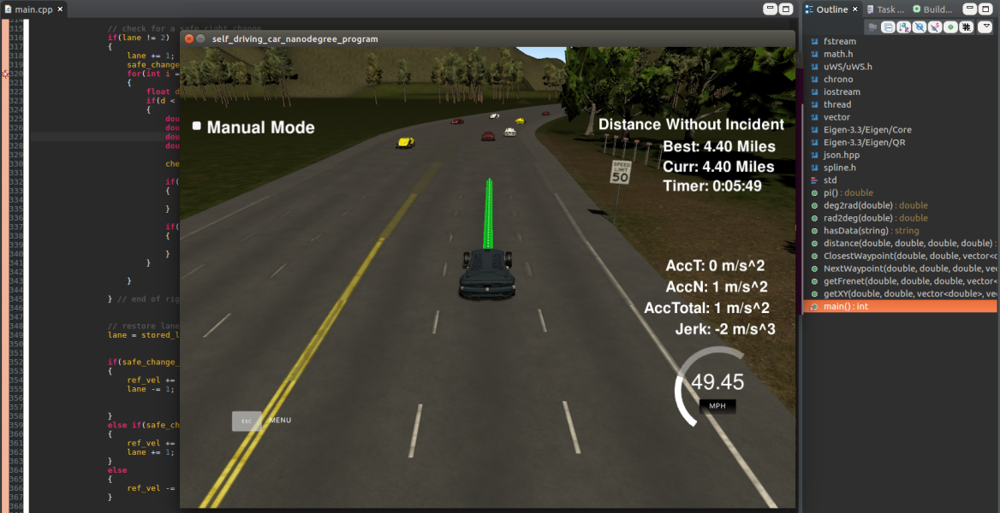
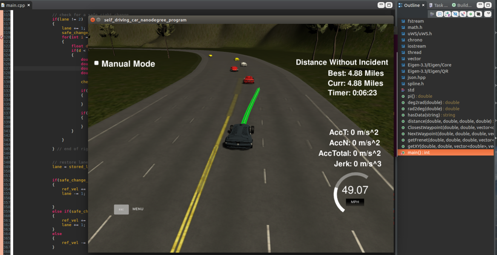

# Path Planner (Simple)
## Udacity - Term 3 - Project 1

## Usage
A script `rr.sh` is provided to make compilation and running easy. Alternatively the user can run the following commands from terminal:


## Response to rubric requirements
### Compilation
* Criteria - Code compiles correctly.
* Response - Code compiles correctly with cmake and make under Ubunutu 16.04 using GNU 5.4.0

### Valid trajectories
* Criteria - Car is able to drive 4.32 miles without incident.
* Response - The car is able to drive the required distance.



* Criteria - The car drives according to the speed limit.
* Response - Car does not exceed the speed limit, only slowing down if there is a car in front, and a lane change is not possible.

* Criteria - Max Acceleration and Jerk are not Exceeded.
* Response - Limits are not exceeded.

* Criteria - Car does not have collisions.
* Response - Car does not have collisions (although sometimes, it is not dynamic enough to avoid a collision if a car turns immediately in front of it). But for most implementations, it drives around the track ok.

* Criteria - The car stays in its lane, except for the time between changing lanes.
* Response - It remains within lanes and performs lane changes within 3 seconds.

* Criteria - The car is able to change lanes.
* Response - It performs lane changes.



### Reflection
A simplified path planner, that utilises the Udacity Path Planning simulator, to navigate a highway populated with traffic. This path planner is simplistic in that it attempts to maintain a constant velocity - if it cannot do this, due to other obstructions (such as a in front within 30 metres), it will consider a lane change. If both lane changes are possible, it will execute the left lane change over the right lane change, assuming the left lane is the "fast lane". In the event that a lane change is not possible, it will slow down. 

I've termed this a simple path planner because this path planner has not implemented cost functions for the behaviour comparison, nor is the behaviour layer sending desired velocity and next state to a typical trajectory generator (typical meaning that there are pertubations based on the behaviour request to generate multiple possible paths based on jerk minimisation, and choosing the best trajectory based on minimum cost). The behaviour outcome is considered absolute in its determination, and the speed is governed by considering the maximum allowable acceleration per time step. 

The outcome of the behaviour layer is passed to a trajectory generator specifically catered to the Udacity Path Planning simulator. The trajectory generator populates vectors of points that are consumed by the simulator on each iteration. After consumption, these points are removed from the trajectory vectors. Each iteration, these vectors are "topped up" to 50 points.

## Dependencies

* cmake >= 3.5
 * All OSes: [click here for installation instructions](https://cmake.org/install/)
* make >= 4.1
  * Linux: make is installed by default on most Linux distros
  * Mac: [install Xcode command line tools to get make](https://developer.apple.com/xcode/features/)
  * Windows: [Click here for installation instructions](http://gnuwin32.sourceforge.net/packages/make.htm)
* gcc/g++ >= 5.4
  * Linux: gcc / g++ is installed by default on most Linux distros
  * Mac: same deal as make - [install Xcode command line tools]((https://developer.apple.com/xcode/features/)
  * Windows: recommend using [MinGW](http://www.mingw.org/)
* [uWebSockets](https://github.com/uWebSockets/uWebSockets)
  * Run either `install-mac.sh` or `install-ubuntu.sh`.
  * If you install from source, checkout to commit `e94b6e1`, i.e.
    ```
    git clone https://github.com/uWebSockets/uWebSockets 
    cd uWebSockets
    git checkout e94b6e1
    ```


